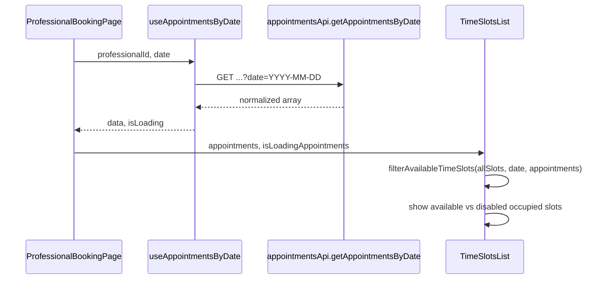

# Plan: Slots ocupados deshabilitados y loader en TimeSlotsList

## Diagnóstico

- **TimeSlotsList** ya tiene la lógica correcta: recibe `appointments`, usa `filterAvailableTimeSlots` y `isTimeSlotOccupied` de [src/lib/availability-utils.ts](src/lib/availability-utils.ts), y pinta los slots ocupados como deshabilitados con "(Ocupado)".
- **Problema 1 – Forma de la respuesta del API**: El backend devuelve `{ success, data: [ {...}, ... ] }` (array directo en `data`). El frontend en [src/features/appointments/api.ts](src/features/appointments/api.ts) hace `response.data.data.appointments`, que asume `data: { appointments: [...] }`. Con la respuesta actual, `data.appointments` es `undefined`, por lo que las citas nunca llegan al componente y ningún slot se marca como ocupado.
- **Problema 2 – Loader**: No se expone el estado de carga de las citas al componente. En [ProfessionalBookingPage.tsx](src/features/availability/pages/ProfessionalBookingPage.tsx) solo se usa `isLoading` de `createAppointment.isPending` (botón "Confirmar"); no se pasa el `isLoading` de `useAppointmentsByDate`, por lo que no se puede mostrar un spinner mientras se cargan las citas del día.

## Cambios propuestos

### 1. Ajustar parsing de la respuesta en el API de appointments

**Archivo:** [src/features/appointments/api.ts](src/features/appointments/api.ts)

- En `getAppointmentsByDate` y en `getProfessionalAppointments`, normalizar la respuesta para aceptar tanto `data` como array como `data.appointments`:
  - Obtener `const raw = response.data.data`.
  - Devolver `(Array.isArray(raw) ? raw : raw?.appointments) ?? []`.
- Así se mantiene compatibilidad si en el futuro el backend devuelve `{ data: { appointments: [...] } }` y se corrige el caso actual donde `data` es el array.

### 2. Pasar estado de carga de citas al componente

**Archivo:** [src/features/availability/pages/ProfessionalBookingPage.tsx](src/features/availability/pages/ProfessionalBookingPage.tsx)

- En la llamada a `useAppointmentsByDate`, desestructurar también `isLoading: isAppointmentsLoading`.
- Pasar a `TimeSlotsList` una nueva prop, por ejemplo `isLoadingAppointments={isAppointmentsLoading}`.

### 3. Mostrar spinner en TimeSlotsList mientras cargan las citas

**Archivo:** [src/features/availability/components/TimeSlotsList.tsx](src/features/availability/components/TimeSlotsList.tsx)

- Añadir a la interfaz `TimeSlotsListProps` la prop opcional `isLoadingAppointments?: boolean` (por defecto `false`).
- Mantener el encabezado (día, texto "Selecciona un horario disponible") siempre visible.
- Cuando `isLoadingAppointments === true`, en la zona del listado de slots mostrar un bloque centrado con:
  - Un spinner (por ejemplo `Loader2` de `lucide-react` con `className="... animate-spin"`, alineado con el uso en [SignupForm](src/features/auth/pages/signup/components/SignupForm.tsx) y [AvailabilityPage](src/features/availability/pages/AvailabilityPage.tsx)).
  - Texto breve en español, p. ej. "Cargando horarios...".
- Cuando `isLoadingAppointments === false`, renderizar la lógica actual (slots disponibles, slots ocupados deshabilitados, diálogo).
- No mezclar responsabilidades: `isLoading` sigue siendo solo para el estado de la mutación (botón "Confirmar" / "Confirmando...").

## Flujo de datos (resumen)

## Verificación

- Con la respuesta de ejemplo (cita 10:00–11:00 el 2026-02-02), el slot 10:00–11:00 debe aparecer deshabilitado y con texto "(Ocupado)".
- Al elegir una fecha, debe verse el spinner "Cargando horarios..." hasta que termine la petición de citas; luego la lista de slots (disponibles y ocupados) sin spinner.
- Principios: un solo lugar para normalizar la respuesta (API), una prop clara para carga de citas (`isLoadingAppointments`), componente sin lógica nueva de ocupación (se reutiliza `filterAvailableTimeSlots`/`isTimeSlotOccupied`).

